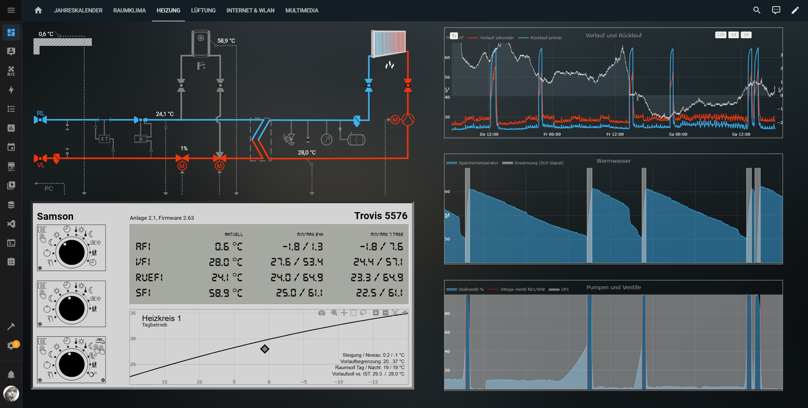
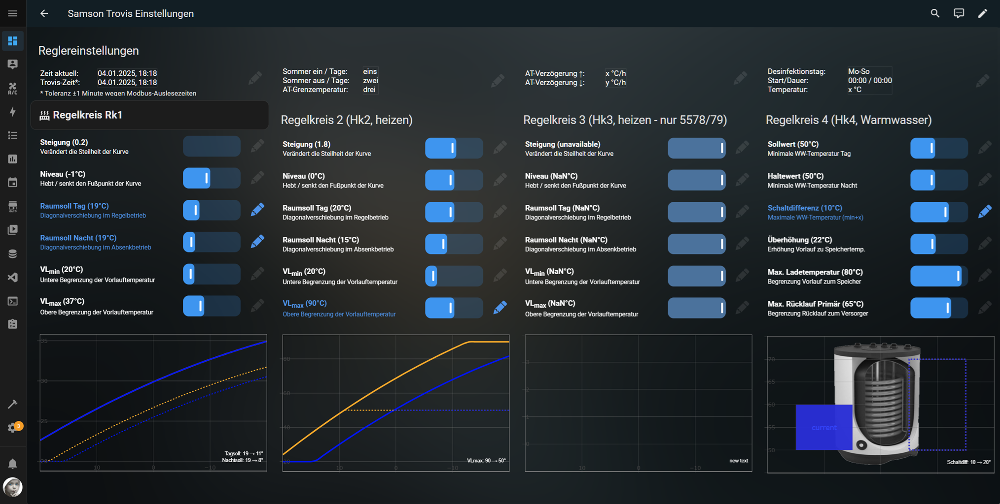
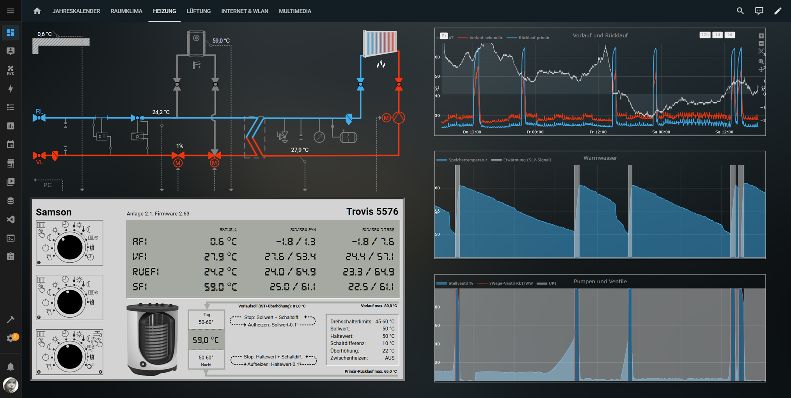

# Samson TROVIS 557x – Home Assistant integration

> [!IMPORTANT]
>
>This project is still under development. Many functions are still experimental and subject to change in the near future.
>
> The [project wiki](https://github.com/Tom-Bom-badil/trovis-modbus-hass/wiki) contains the detailed setup guide, current entity structure, architecture notes, and [instructions for contributors](https://github.com/Tom-Bom-badil/trovis-modbus-hass/wiki/Contributions).

This repository contains a native Home Assistant custom integration for Samson TROVIS 557x heating controllers (also usable with some OEM Sauter and Pewo heating controllers).

The integration exposes TROVIS controllers as Home Assistant devices and entities. Physical Modbus connections are configured and owned by the separate Home Assistant `modbus_connection` integration. No YAML Modbus configuration is required.

<br/>&nbsp;&nbsp;

## Features

- UI-based setup
- Shared Modbus connections
- Multiple controllers
- Automatic model and physical-sensor detection
- Model-specific two- or three-heating-circuit profiles
- Network, local serial, and serial-URL connections
- Range-aware grouped reads
- Register and coil writes
- Write-access safety switch
- Native date and time entities
- Reconfiguration without changing existing entity IDs
- German and English translations

## Supported model profiles

| Models | Heating circuits | Profile |
| --- | ---: | --- |
| TROVIS 5573, 5573-1, 5575, 5576 | Rk1 and Rk2 | TROVIS 5573 |
| TROVIS 5578, 5578-E, 5579 | Rk1, Rk2, and Rk3 | TROVIS 5578 |

The domestic-hot-water circuit is represented as Rk4.

## Prerequisite

Before adding a TROVIS controller, install the Home Assistant `modbus_connection` integration and create at least one connection entry.

Use:

- **Network** for native Modbus TCP or a gateway that translates Modbus TCP to Modbus RTU
- **Serial** with a URL such as `socket://192.168.1.50:502` for transparent RTU over TCP by using ser2net adapters
- **Serial** with a URL such as `esphome://192.168.1.50` for transparent RTU over TCP by using ESP-based installations
- **Serial** with `/dev/ttyUSB0`, `rfc2217://...`, or another supported serial URL for local or forwarded serial connections

A **serial** URL is always using transparent serial forwarding over TCP. It is not native Modbus TCP.

## Installation

### HACS

[](https://my.home-assistant.io/redirect/hacs_repository/?owner=Tom-Bom-badil&repository=trovis-modbus-hass&category=integration)

1. Make sure [HACS](https://www.hacs.xyz/) is installed in Home Assistant.
2. Click the badge above and add this repository as an **Integration**.
3. Return to HACS, search for **Samson TROVIS 557x**, and download the integration.
4. Restart Home Assistant.
5. Open `Settings → Devices & services → Add integration`.
6. Search for **Samson TROVIS 557x**.
7. Select an existing Modbus Connection entry and enter the controller's Modbus unit ID.

The default TROVIS unit ID is `246`.

### Manual installation

1. Download the latest release from the [GitHub releases page](https://github.com/Tom-Bom-badil/trovis-modbus-hass/releases).
2. Copy `custom_components/trovis557x` to `/config/custom_components/trovis557x`.
3. Restart Home Assistant.
4. Open `Settings → Devices & services → Add integration`.
5. Search for **Samson TROVIS 557x**.
6. Select an existing Modbus Connection entry and enter the controller's Modbus unit ID.

## Entity platforms

The integration currently provides:

- `sensor`
- `binary_sensor`
- `number`
- `select`
- `switch`
- `date`
- `time`
- `climate`
- `water_heater`

The standard Home Assistant entities are the primary representation of the TROVIS data model. `climate` and `water_heater` provide additional convenience views over the same library-backed values.

Writable values are protected by the controller-level **Write access** switch. Limits, options, scaling, and TROVIS-specific write rules are provided by the [`trovis-modbus`](https://github.com/Tom-Bom-badil/trovis-modbus) library.

## Architecture

```text
Home Assistant entities
        │
        ▼
trovis-modbus-hass
        │
        ▼
trovis-modbus
        │
        ▼
Home Assistant modbus_connection integration
        │
        ▼
modbus-connection / tmodbus / serialx
        │
        ▼
Physical TROVIS device or gateway
```

The TROVIS integration does not open or close the physical connection. It selects an existing `modbus_connection` config entry and obtains a shared Modbus unit from it.

## Development

Install the local device library when required:

```bash
cd /config/dev/trovis-modbus
python -m pip install -e .
```

Install the local checking tools:

```bash
python -m pip install --upgrade ruff pytest pytest-asyncio
```

Run the checks supported by the HAOS / VS Code development shell:

```bash
cd /config/dev/trovis-modbus-hass
script/hasscheck.sh
```

The complete Home Assistant integration test suite requires a prepared Home Assistant development environment and is also executed by GitHub Actions.